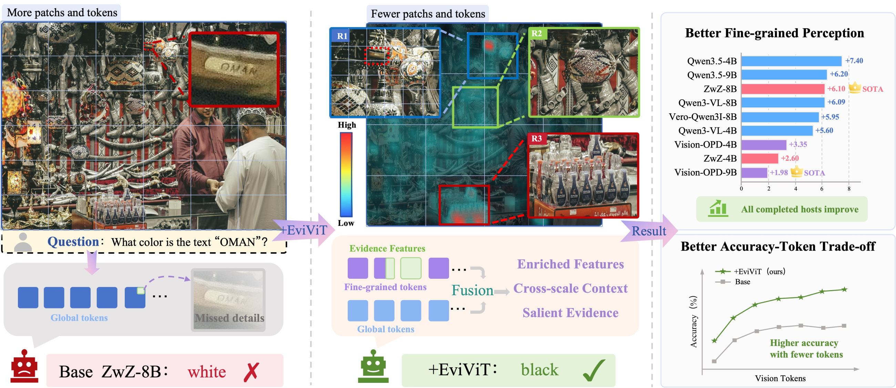
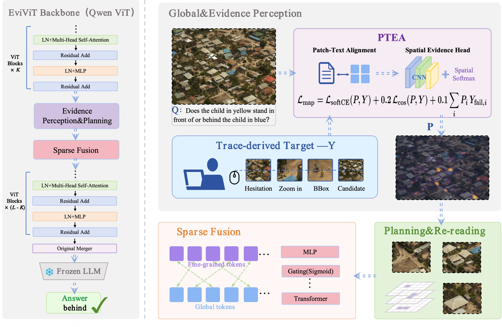
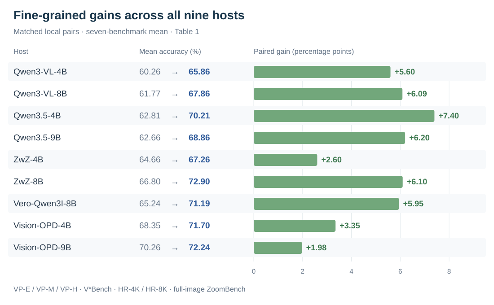

<div align="center">

# EviViT

### Evidence-Adaptive Vision Transformers for Fine-Grained Perception

**Learn where to acquire detail. Preserve the scene that gives it meaning.**

[](https://arxiv.org/abs/2609.37123)
[](https://huggingface.co/datasets/YXNiu/Human-Search-Traces)

[Paper](https://arxiv.org/abs/2609.37123) · [Dataset](https://huggingface.co/datasets/YXNiu/Human-Search-Traces) · [Getting Started](#getting-started) · [Citation](#citation)

<a href="docs/assets/teaser.png"></a>

</div>

EviViT is a lightweight attachment to a pretrained vision transformer. Human visual-search traces teach it **where to acquire detail**; regional re-reading recovers that detail from the original pixels, and sparse fusion connects it to the global scene. The host backbone stays frozen during attachment training.

## Overview

- **Human-search supervision.** Learn question-conditioned evidence allocation from the search process, beyond its final evidence box.
- **Detail in context.** Allocate visual capacity to relevant regions while preserving global information through coordinate-aware sparse fusion.
- **Reusable perception.** Improve average fine-grained accuracy across nine foundation and post-trained hosts; transfer a foundation-family attachment to compatible descendants without refitting.

<p align="center">
  <a href="docs/assets/pipeline.png"></a>
</p>

*Human traces supervise evidence prediction during training. At inference, EviViT selects and re-reads regions for the input question and incorporates their features into the host representation.*

## Results

All nine locally evaluated host pairs improve on the paper's seven-benchmark mean, with gains of **+1.98 to +7.40 percentage points**.

<p align="center">
  <a href="docs/assets/paired-gains.svg"></a>
</p>

The mean equally weights VisualProbe Easy/Medium/Hard, V*Bench, HR-Bench 4K/8K, and full-image ZoomBench. These are matched local host/host+EviViT comparisons, not a ranking against mixed-source API results. Individual benchmark scores, including mixed outcomes, are available in [the full paired results](results/fine_grained_open_pairs.csv).

Matched-budget experiments also show higher accuracy at every tested token ceiling while using **90–97% of the paired global-only visual tokens**. See the [paper](https://arxiv.org/abs/2609.37123) for the protocol, runtime overhead, transfer experiments, and ablations.

## Getting Started

### Release status

| Resource | Availability |
| --- | --- |
| Training and evaluation implementation | This repository; public launchers target **Qwen3-VL-4B/8B** |
| Reported results and training curves | [`results/`](results/) |
| 1,144 raw human-search sessions | [Hugging Face dataset](https://huggingface.co/datasets/YXNiu/Human-Search-Traces) |
| Trained EviViT attachment checkpoints | **Not included in this release** |
| Host/judge model weights and benchmark images | Obtain separately from their original providers |
| Matched 10K QA/SFT training data | Not included in this repository |

The paper evaluates nine hosts; this does not mean every host has a ready-to-run public launcher or downloadable attachment checkpoint here. GPU inference requires compatible checkpoints and external assets.

### Set up the code

```bash
git clone https://github.com/YXNiu/EviViT.git
cd EviViT
python3 verify_release.py
```

Use Python 3 with CUDA-enabled PyTorch, NumPy, Pillow, Qwen3-VL-compatible Transformers, Safetensors, and PEFT. The verifier runs offline and checks source syntax, local paths/imports, and result structure; it does not run GPU inference. See [evaluation setup](docs/evaluation.md) for the asset layout and full commands.

### Load the human-search annotations

```bash
pip install datasets
```

```python
from datasets import load_dataset

sessions = load_dataset("YXNiu/Human-Search-Traces", "raw", split="train")
print(len(sessions))  # 1144
```

These are de-identified mouse-interaction records and final evidence boxes, not eye-gaze measurements or human-written chains of thought. Original images are not redistributed in the annotation dataset; obtain them from [VisualProbe_train](https://huggingface.co/datasets/Mini-o3/VisualProbe_train). The [dataset card](https://huggingface.co/datasets/YXNiu/Human-Search-Traces) documents fields, quality considerations, and the CC BY-NC 4.0 annotation license.

### Evaluate with prepared checkpoints

After preparing the assets described in [the evaluation guide](docs/evaluation.md):

```bash
export EVIVIT_PYTHON=python3
export EVIVIT_DATA_ROOT=../assets
bash run_final_eval.sh 4b visualprobe \
  ../assets/model4 ../assets/selector4.pt ../assets/context4.pt \
  ../assets/bridge4.pt ../assets/h_safe4.pt \
  ../assets/visualprobe.jsonl ../work/visualprobe_evivit.jsonl 0
```

Use `8b` and scale-matched checkpoints for Qwen3-VL-8B. Set `EVIVIT_LIMIT=1` for a one-question test or `EVIVIT_DRY_RUN=1` to inspect the command after input-path validation. Baseline evaluation, local judging, supported benchmark keys, and SFT evaluation are covered in [the full guide](docs/evaluation.md).

## Training

The attachment is trained in stages: **PTEA → ContextNeed → H-Safe → Sparse Bridge**, using prepared trace-derived targets and frozen host features. The repository also contains the matched language-side SFT comparison.

See [the training guide](docs/training.md) for component entry points, Bridge training, and the matched SFT commands. The raw annotation JSONL is not a precomputed component-training manifest; prepare the targets and features before invoking the corresponding training programs.

## Repository Map

| Path | Purpose |
| --- | --- |
| [`evivit_core/`](evivit_core/) | Evidence allocation, native-detail acquisition, and fusion implementation |
| [`scripts/`](scripts/) | Data preparation, component training, evaluation, and local judging |
| `run_final_*.sh` | Scale-matched evaluation, baseline, judge, and Bridge launchers |
| [`run_matched_sft.sh`](run_matched_sft.sh) | Matched Base+SFT / EviViT+SFT launchers |
| [`results/`](results/) | Reported numerical summaries and training curves |
| [`docs/`](docs/) | Usage guides and project-page figures |

## Citation

If you use EviViT or its human-search annotations, please cite:

```bibtex
@misc{niu2026evivit,
  title         = {EviViT: Evidence-Adaptive Vision Transformers for Fine-Grained Perception},
  author        = {Yaoxin Niu and Zhangquan Chen and Yang Zhang and Xiang An and Zhumei Wang and Chih-Ting Liao and Hongkun Cao and Ruqi Huang},
  year          = {2026},
  eprint        = {2609.37123},
  archivePrefix = {arXiv},
  primaryClass  = {cs.CV},
  url           = {https://arxiv.org/abs/2609.37123}
}
```

For VisualProbe questions and images, also credit [Mini-o3 / VisualProbe](https://github.com/Mini-o3/Mini-o3) and follow the upstream terms. Questions or reproducibility issues are welcome through [GitHub Issues](https://github.com/YXNiu/EviViT/issues).
